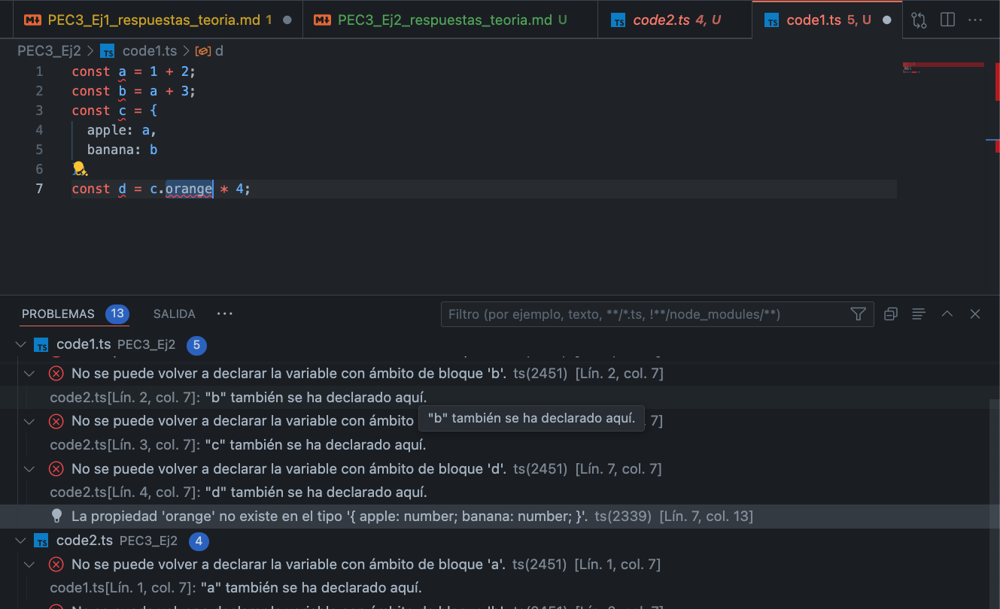

# Type Error

En este código modificado, se producirá un error de tipo (`TypeError`) en la línea `const d = c.orange * 4;`. Esto se debe a que estamos intentando acceder a la propiedad `orange` del objeto `c`, que no existe. Como resultado, `c.orange` es `undefined`, y al intentar multiplicar `undefined` por 4, TypeScript genera un error de tipo porque la multiplicación no está definida para `undefined`.

La ventaja de este comportamiento en TypeScript es que nos ayuda a detectar errores potenciales en tiempo de compilación en lugar de en tiempo de ejecución. Esto puede ahorrar mucho tiempo de depuración y evitar comportamientos inesperados en nuestro código. Además, este tipo de comprobaciones de tipo hacen que nuestro código sea más predecible y fácil de entender, lo que puede ser especialmente útil en proyectos grandes y complejos.

## 1. Para cada uno de los valores del fichero code2.ts, ¿Qué tipo de datos inferirá TypeScript? Explica por qué se ha inferido este tipo de datos.

1. `const a = 1042;` - TypeScript inferirá que `a` es de tipo `number`. Esto se debe a que 1042 es un valor numérico.

2. `const b = 'apples and oranges';` - TypeScript inferirá que `b` es de tipo `string`. Esto se debe a que 'apples and oranges' es una cadena de caracteres.

3. `const c = 'pineapples';` - TypeScript inferirá que `c` es de tipo `string`. Esto se debe a que 'pineapples' es una cadena de caracteres.

4. `const d = [true, true, false];` - TypeScript inferirá que `d` es de tipo `boolean[]` (un array de booleanos). Esto se debe a que todos los elementos del array son de tipo booleano.

5. `const e = { type: 'ficus' };` - TypeScript inferirá que `e` es de tipo `{ type: string }`. Esto se debe a que el objeto tiene una propiedad `type` que es de tipo `string`.

6. `const f = [1, false];` - TypeScript inferirá que `f` es de tipo `(number | boolean)[]` (un array de números o booleanos). Esto se debe a que el array contiene tanto números como booleanos.

7. `const g = [3];` - TypeScript inferirá que `g` es de tipo `number[]` (un array de números). Esto se debe a que todos los elementos del array son de tipo numérico.

8. `const h = null;` - TypeScript inferirá que `h` es de tipo `null`. Esto se debe a que el valor asignado es `null`.

## 2. ¿Por qué se dispara cada uno de los errores del fichero code3.ts?

1. `i = 4;` - Este código genera el error TS2588 porque `i` se ha declarado como una constante con el valor 3. En TypeScript, una constante no puede cambiar su valor una vez asignado.

2. `j.push('5');` - Este código genera el error TS2345 porque se está intentando añadir un valor de tipo `string` a un array que TypeScript ha inferido como de tipo `number[]`. En TypeScript, un array de un tipo específico solo puede contener elementos de ese tipo.

3. `let k: never = 4;` - Este código genera el error TS2322 porque se está intentando asignar el valor 4 a una variable de tipo `never`. En TypeScript, `never` es un tipo que representa el tipo de valor que nunca ocurre. Por ejemplo, se utiliza como tipo de retorno para funciones que siempre lanzan una excepción o que tienen un bucle infinito.

4. `let m = l * 2;` - Este código genera el error TS2571 porque se está intentando realizar una operación matemática en una variable de tipo `unknown`. En TypeScript, `unknown` es un tipo que representa cualquier tipo de valor, pero no se puede realizar ninguna operación en un valor de tipo `unknown` sin antes realizar una comprobación de tipo.

## 3. ¿Cuál es la diferencia entre una clase y una interface en TypeScript?

Una **clase** y una **interface** en TypeScript tienen algunas diferencias clave:

1. **Clases**: Las clases son una característica de ES6 que TypeScript extiende con modificadores de acceso, tipos estáticos y más. Las clases pueden contener detalles de implementación, como métodos y propiedades. Las clases también pueden ser instanciadas y extendidas.

2. **Interfaces**: Las interfaces son una característica exclusiva de TypeScript (y otros lenguajes de tipado estático) que permite definir la forma de un objeto. Las interfaces son útiles para definir contratos para las clases para asegurar que implementen ciertas propiedades o métodos. Sin embargo, las interfaces no pueden contener detalles de implementación ni pueden ser instanciadas o extendidas.

En resumen, las clases son para definir y crear objetos, mientras que las interfaces son para definir contratos de forma para los objetos. Las interfaces son útiles para definir la forma de los objetos, especialmente cuando se trata de objetos complejos, y las clases son útiles para crear objetos con comportamientos específicos.